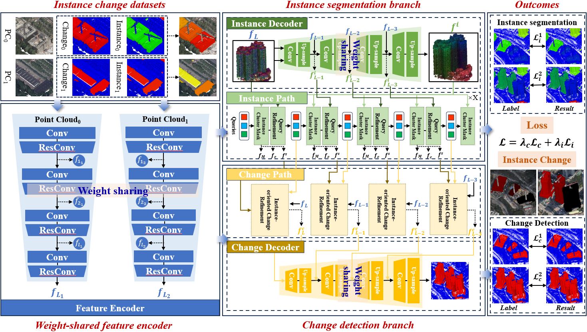

# 3DInstanceCD

         

3DInstanceCD is a novel end-to-end 3D Instance Change Detection model, 3DInstanceCD, which deeply couples instance segmentation and change detection within a unified architecture. 3DInstanceCD is composed of the instance segmentation branch and the change detection branch. The instance segmentation branch incorporates an instance cluster mask (ICM) module to guide instance identification via feature clustering, reducing computational complexity while improving accuracy. The change detection branch introduces an instance-oriented change refinement (ICR) module that leverages instance masks to focus on target instance changes and suppress background noise.
